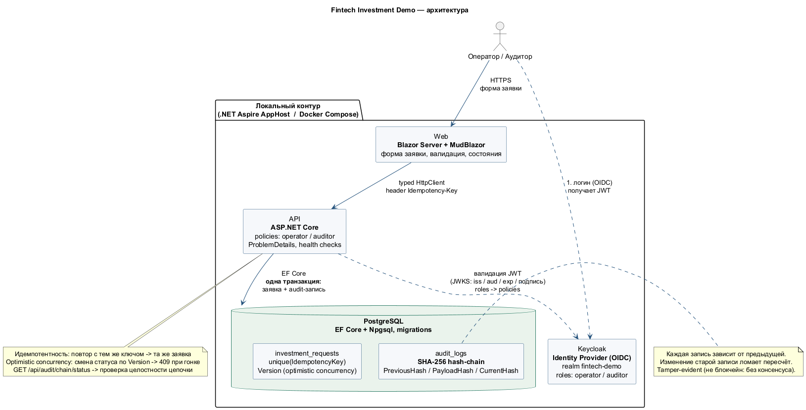
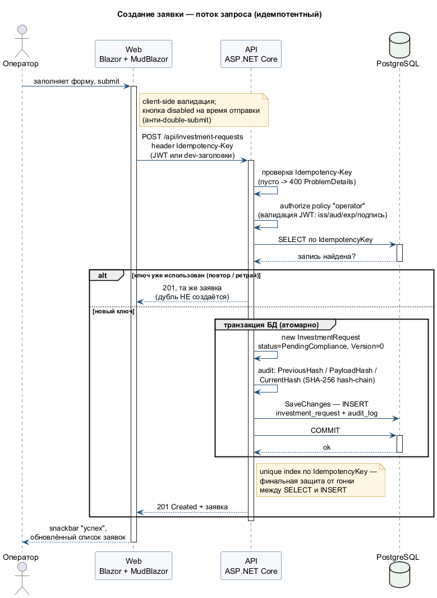
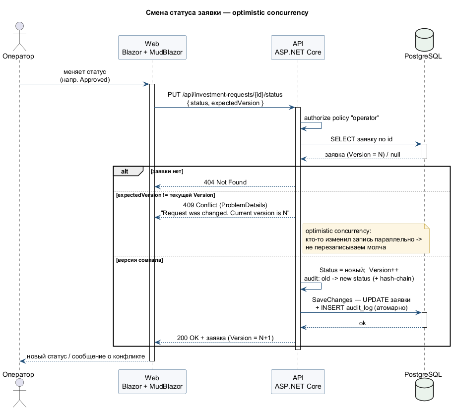
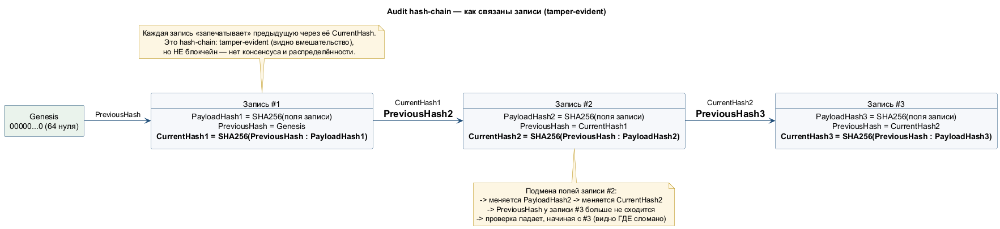
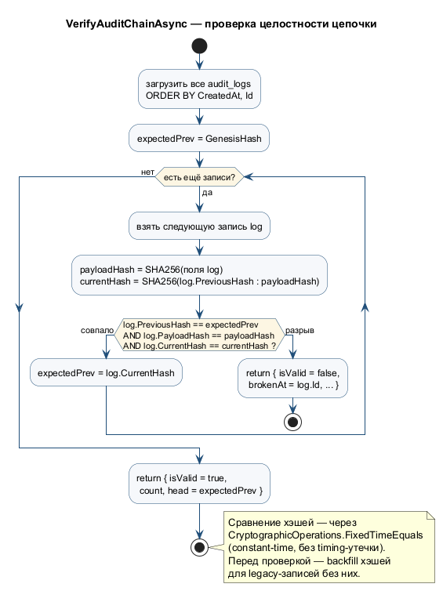

# Fintech Investment Demo

Компактное demo-приложение на .NET для обработки заявок на инвестиционные операции.

Проект показывает типичный внутренний fintech-сценарий: веб-форма на Blazor/MudBlazor отправляет заявки в ASP.NET Core API, API сохраняет данные в PostgreSQL, ведёт аудит, поддерживает Keycloak-ready аутентификацию и запускается как набор контейнеризованных сервисов.

## Стек

- .NET 8, C#
- ASP.NET Core Web API
- Blazor Server
- MudBlazor
- PostgreSQL, EF Core, Npgsql
- Keycloak-ready JWT authentication
- .NET Aspire AppHost
- Docker Compose
- xUnit tests

## Возможности

- Форма создания инвестиционной заявки с валидацией и loading-состояниями.
- Список заявок со сменой статусов.
- Хранение данных в PostgreSQL через EF Core migrations.
- Идемпотентное создание заявки через header `Idempotency-Key`.
- Optimistic concurrency через проверку ожидаемой версии.
- Audit log для создания заявки и смены статуса.
- SHA-256 audit hash-chain для tamper-evident проверки аудита.
- Development auth mode для локального запуска.
- Keycloak realm import с ролями `operator` и `auditor`.
- Health checks для API и PostgreSQL.

## Архитектура



Исходник диаграммы: [docs/diagrams/architecture.puml](docs/diagrams/architecture.puml) (рендер: `plantuml -tpng docs/diagrams/architecture.puml`).

### Поток создания заявки (идемпотентный)



Исходник: [docs/diagrams/create-investment-request.puml](docs/diagrams/create-investment-request.puml).

### Смена статуса (optimistic concurrency)



Исходник: [docs/diagrams/update-status.puml](docs/diagrams/update-status.puml).

### Audit hash-chain (tamper-evident)



Исходник: [docs/diagrams/audit-hash-chain.puml](docs/diagrams/audit-hash-chain.puml).

### Проверка целостности — VerifyAuditChainAsync



Исходник: [docs/diagrams/verify-audit-chain.puml](docs/diagrams/verify-audit-chain.puml).

```text
Blazor Web UI
    |
    v
ASP.NET Core API
    |
    +-- PostgreSQL
    |
    +-- Keycloak-ready JWT auth
    |
    +-- Audit log with SHA-256 hash-chain
```

## Запуск Через Docker Compose

```powershell
docker compose up -d --build
```

После запуска:

- Web UI: http://localhost:8082
- API Swagger: http://localhost:8081/swagger
- API health: http://localhost:8081/health/live
- Audit chain status: http://localhost:8081/api/audit/chain/status
- Keycloak: http://localhost:8080

Keycloak admin:

- Login: `admin`
- Password: `admin`

Demo user в realm `fintech-demo`:

- Login: `operator`
- Password: `Passw0rd!`

По умолчанию Docker Compose запускает API с `Auth__Mode=Development`, поэтому UI работает локально без OIDC login flow. Keycloak при этом тоже поднимается и импортирует realm, так что JWT mode можно проверить отдельно: переключить `Auth__Mode=Keycloak` и передавать валидный access token в API.

## Сборка И Тесты

```powershell
dotnet build Fintech.InvestmentDemo.slnx
dotnet test tests\Fintech.Api.Tests\Fintech.Api.Tests.csproj
```

## Запуск Через Aspire

```powershell
dotnet run --project src\Fintech.AppHost\Fintech.AppHost.csproj
```

AppHost описывает PostgreSQL, Keycloak, API, web-приложение и зависимости между сервисами.

## Процесс Разработки

В репозитории используется облегчённый Git Flow с ветками `main`, `develop`, `feature/*`, `release/*` и `hotfix/*`. Подробности: [docs/git-flow.md](docs/git-flow.md).

## Полезные Endpoints

- `GET /api/investment-requests`
- `POST /api/investment-requests`
- `PUT /api/investment-requests/{id}/status`
- `GET /api/audit`
- `GET /api/audit/chain/status`
- `GET /health/live`
- `GET /health/ready`

## Очистка

```powershell
docker compose down
```

Удалить данные PostgreSQL:

```powershell
docker compose down -v
```
